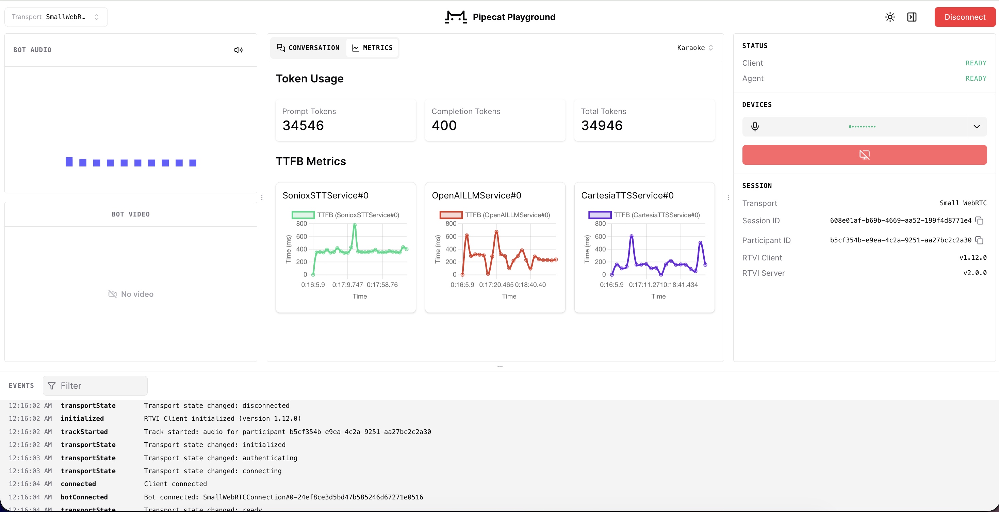

# PhoneLLM on a single L40S (FP8, Modal + vLLM)

**Why this repo exists:** it lets you run a GPT-5.6-level model for voice
agents fully self-hosted for $1.5k/month. PhoneLLM's model card reports
parity with GPT 5.6 Terra on voice-agent tasks; an always-on L40S on Modal is
$1.95/hr (~$1,500/mo), serves ~16 concurrent calls, and your call data never
leaves your infra.

[`pipecat-ai/phonellm-alpha-1`](https://huggingface.co/pipecat-ai/phonellm-alpha-1)
is a 30B hybrid Mamba-Transformer MoE that ships bf16-only (~60 GB) - it does
not fit a 48 GB L40S, and vLLM's online `--quantization fp8` OOMs at its bf16
load peak. This repo quantizes it **once** to an offline FP8 checkpoint
(~32 GB, data-free, no calibration set) and serves it with vLLM on **one
L40S on Modal** - roughly **1/3 the GPU cost of the B200** the model is
demonstrated on. At `temperature=0` the FP8 output matched the bf16 endpoint
byte-for-byte in our spot checks, and a single stream decodes at ~170 tok/s.

## Quickstart

**1. Quantize the model** (one-time, H200, ~10 min — writes the FP8 checkpoint to a Volume):

```sh
modal run modal_quantize_fp8.py
```

**2. Deploy the server** (1x L40S, OpenAI-compatible endpoint):

```sh
modal deploy modal_l40s_fp8.py
```

Copy the base URL it prints
(`https://<workspace>--ep-phonellm-alpha-1-l40s-fp8-server-serve.modal.run`).

**3. Configure `.env`:**

```sh
cp .env.example .env
```

- `MODAL_LLM_BASE_URL` — the URL from step 2
- `MODAL_LLM_API_KEY` — create a Proxy Auth Token (modal.com → Settings →
  Proxy Auth Tokens), paste as `wk-<id>.ws-<secret>`

**4. Benchmark** (TTFT / throughput vs concurrency):

```sh
modal run modal_bench.py
```

**5. Stop the container when done:**

```sh
modal app stop ep-phonellm-alpha-1-l40s-fp8
```

> ⚠️💸 `MIN_CONTAINERS = 1` in `modal_l40s_fp8.py` keeps one L40S running 24/7
> (~$1.95/hr, ~$1,400/mo) even with zero traffic. Don't skip this step — or
> set `MIN_CONTAINERS = 0` and redeploy for scale-to-zero.



## Results

Measured by `modal_bench.py` running **inside Modal** (no WAN in the numbers what a bot co-located with the endpoint sees). Voice-agent style requests: ~150-token system prompt, short unique user turn, 80-token streamed completions; 3 rounds per level, stats pooled:

| concurrency | TTFT p50 | TTFT p95 | tok/s per stream (p50) | tok/s min | aggregate tok/s |
| ----------: | -------: | -------: | ---------------------: | --------: | --------------: |
|           1 |   260 ms |   270 ms |                    170 |       170 |              88 |
|           8 |   421 ms |   439 ms |                     76 |        63 |             301 |
|          16 |   486 ms |   518 ms |                     57 |        46 |             477 |
|          32 |   700 ms |   754 ms |                     38 |        26 |             683 |

Zero errors at every level. **Usable concurrency for voice: ~16 simultaneous
calls per L40S** (TTFT p95 ≈ 520 ms; at 32 it degrades past ~750 ms). Decode
speed never dropped below ~26 tok/s per stream - far above what real-time TTS
consumes, so TTFT is the binding constraint.

Calling over WAN instead adds your network RTT n top (from our dev box:
+~140 ms on the TTFT floor, same shape otherwise).

## Quality: FP8 vs the bf16 original

**This is a rough, data-free quantization - not yet properly benchmarked.**
Spot checks at `temperature=0` (identical prompts to the bf16 endpoint and
this deployment) came back **byte-for-byte identical**, which is encouraging
but is not an eval. To reliably hold ~99% of bf16 quality, the proven recipe
is NVIDIA's (TensorRT Model Optimizer: keep attention + preceding Mamba
layers in bf16) - which produces a larger checkpoint that may no longer fit
48 GB.

See next steps below.

**External context - what FP8 costs Nemotron-30B-class models.** This model
is a fine-tune of NVIDIA's Nemotron 3 Nano 30B-A3B, and NVIDIA publishes an
[official FP8 build of that base model](https://huggingface.co/nvidia/NVIDIA-Nemotron-3-Nano-30B-A3B-FP8)
reporting **~99% median accuracy recovery** vs bf16 - differences within
noise on standard suites (MMLU-Pro 78.30 FP8 vs 78.10 bf16, GPQA 73.04 vs
72.47, AIME25-with-tools 99.17 vs 98.80; FP8 occasionally scores _higher_).
So for this architecture, well-executed FP8 is effectively lossless.

One recipe difference worth knowing: NVIDIA's build selectively keeps the
self-attention layers (and the Mamba layers preceding them) in bf16 and also
quantizes the KV cache; this repo's recipe quantizes attention and Mamba
projections but keeps `lm_head` + MoE router in bf16 and leaves the KV cache
alone.

## Next steps

Tracked in [`docs/tasks/`](docs/tasks/README.md): quality benchmark FP8 vs
bf16 first; NVIDIA's selective re-quantization recipe as fallback if quality
drifts.
